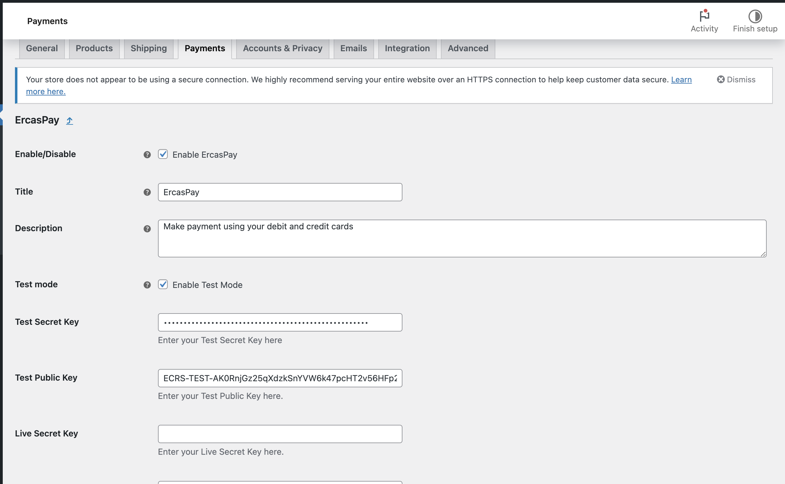
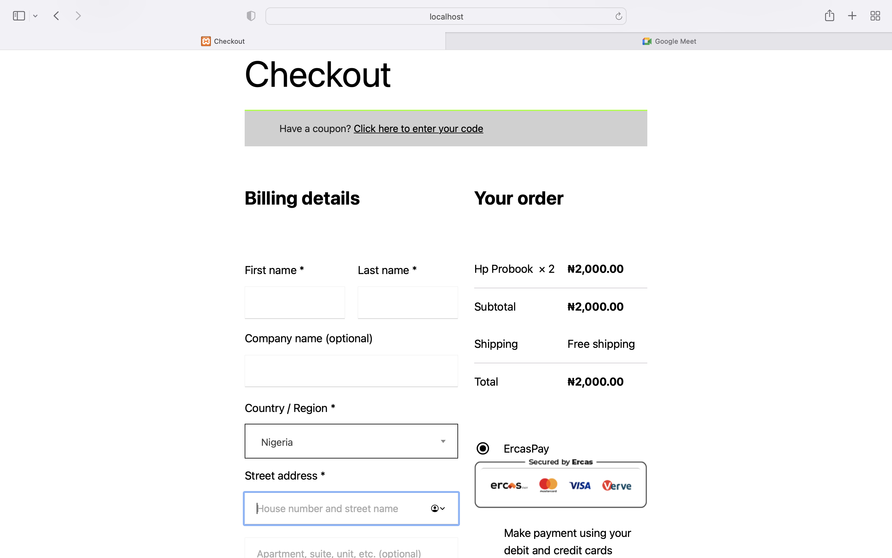
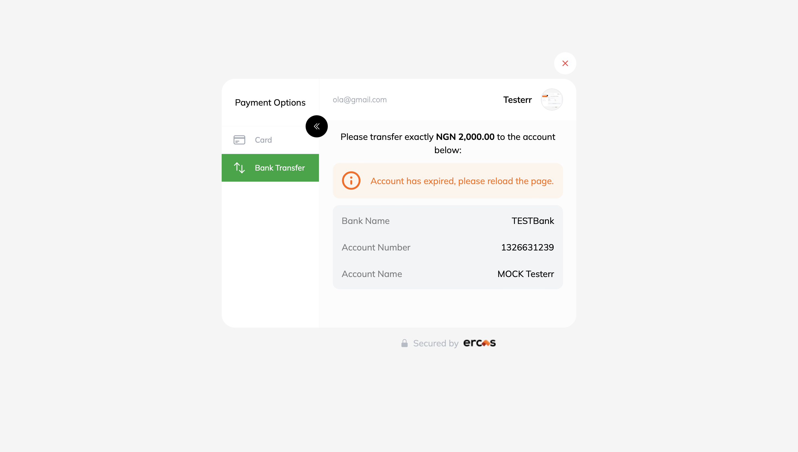

# woo-ercaspay
=== ErcasPay WooCommerce Payment Gateway === Contributors: Michael Tags:
ercaspay, woocommerce, payment gateway, tubiz plugins, verve, ghana,
kenya, nigeria, south africa, naira, cedi, rand, mastercard, visa
Requires at least: 5.8 Tested up to: 6.3 Stable tag: 5.8.0 Requires PHP:
7.4 License: GPLv2 or later License URI:
http://www.gnu.org/licenses/gpl-2.0.html

Ercaspay for WooCommerce allows your store in Nigeria, Ghana, Kenya, or
South Africa to accept secure payments from multiple local and global
payment channels.

== Description ==

Ercaspay makes it easy for businesses in Nigeria, Ghana, Kenya and South
Africa to accept secure payments from multiple local and global payment
channels. Integrate Ercaspay with your store today, and let your
customers pay you with their choice of methods.

With Ercaspay for WooCommerce, you can accept payments via:

-   Credit/Debit Cards --- Visa, Mastercard, Verve (NG, GH, KE),
    American Express (SA only)
-   Bank transfer (Nigeria)
-   Mobile money (Ghana)
-   Masterpass (South Africa)
-   EFT (South Africa)
-   USSD (Nigeria)
-   Visa QR (Nigeria)
-   Many more coming soon

= Why Ercaspay? =

-   Start receiving payments instantly---go from sign-up to your first
    real transaction in as little as 15 minutes
-   Simple, transparent pricing---no hidden charges or fees
-   Modern, seamless payment experience via the Ercaspay Checkout
-   Advanced fraud detection
-   Understand your customers better through a simple and elegant
    dashboard
-   Access to attentive, empathetic customer support 24/7
-   Free updates as we launch new features and payment options
-   Clearly documented APIs to build your custom payment experiences

Over 20,000 businesses of all sizes in Nigeria, Ghana, Kenya, and South
Africa rely on Ercaspay's suite of products to receive payments and make
payouts seamlessly. Sign up on
\[https://merchant.ercaspay.com/auth/register) to get started.

= Note =

This plugin is meant to be used by merchants in Ghana, Kenya, Nigeria
and South Africa.

= Plugin Features =

-   **Accept payment** via Mastercard, Visa, Verve, USSD, Mobile Money,
    Bank Transfer, EFT, Bank Accounts, GTB 737 & Visa QR.
-   **Seamless integration** into the WooCommerce checkout page. Accept
    payment directly on your site

== Installation ==

-   Go to **WordPress Admin** \> **Plugins** \> **Add New** from the
    left-hand menu
-   In the search box type **Ercaspay WooCommerce Payment Gateway**
-   Click on Install now when you see **Ercaspay WooCommerce Payment
    Gateway** to install the plugin
-   After installation, **activate** the plugin.

= Ercaspay Setup and Configuration = \* Go to **WooCommerce \>
Settings** and click on the **Payments** tab \* You'll see Ercaspay
listed along with your other payment methods. Click **Set Up** \* On the
next screen, configure the plugin. There is a selection of options on
the screen. Read what each one does below.

1.  **Enable/Disable** - Check this checkbox to Enable Ercaspay on your
    store's checkout
2.  **Title** - This will represent Ercaspay on your list of Payment
    options during checkout. It guides users to know which option to
    select to pay with Ercaspay. **Title** is set to "Debit/Credit
    Cards" by default, but you can change it to suit your needs.
3.  **Description** - This controls the message that appears under the
    payment fields on the checkout page. Use this space to give more
    details to customers about what Ercaspay is and what payment methods
    they can use with it.
4.  **Test Mode** - Check this to enable test mode. When selected, the
    fields in step six will say "Test" instead of "Live." Test mode
    enables you to test payments before going live. The orders process
    with test payment methods, no money is involved so there is no risk.
    You can uncheck this when your store is ready to accept real
    payments.
5.  **Payment Option** - Select how Ercaspay Checkout displays to your
    customers. A popup displays Ercaspay Checkout on the same page,
    while Redirect will redirect your customer to make payment.
6.  **API Keys** - The next two text boxes are for your Ercaspay API
    keys, which you can get from your Ercaspay Dashboard. If you enabled
    Test Mode in step four, then you'll need to use your test API keys
    here. Otherwise, you can enter your live keys.
7.  Click on **Save Changes** to update the settings.

If you do not find Ercaspay on the Payment method options, please go
through the settings again and ensure that:

-   You've checked the **"Enable/Disable"** checkbox
-   You've entered your **API Keys** in the appropriate field
-   You've clicked on **Save Changes** during setup

== Frequently Asked Questions ==

= What Do I Need To Use The Plugin =

-   A Ercaspay merchant account---use an existing account or [create an
    account here](https://merchant.ercaspay.com/auth/register)
-   An active [WooCommerce
    installation](https://docs.woocommerce.com/document/installing-uninstalling-woocommerce/)
-   A valid [SSL
    Certificate](https://docs.woocommerce.com/document/ssl-and-https/)

== Screenshots ==

1.  Ercaspay WooCommerce payment gateway settings page
    
2. Ercaspay displayed as a payment method on the WooCommerce checkout page
    
3.  Ercaspay payment page
    
